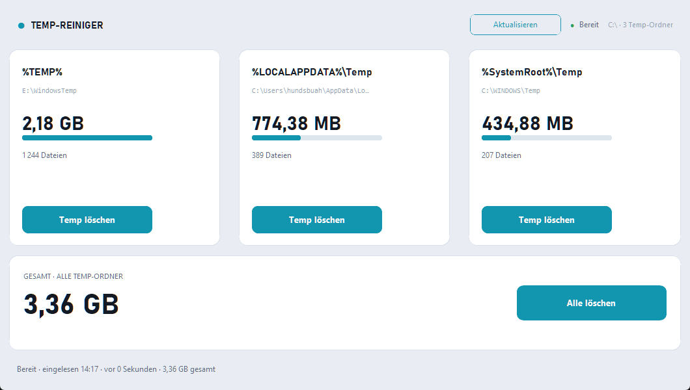

# 🧹 Temp-Reiniger

**Windows-Tool, das drei Temp-Ordnere auf einen Blick zeigt und sicher leert.**
Kein Blindlöschen, keine Wurzelmappen-Gefahr — du siehst, wie „schwer" jeder
Ordner ist, und entscheidest gezielt, was geleert wird.




---

## ✨ Features

- **Drei Temp-Ordnere** als Karten nebeneinander:

  | # | Umgebungsvariable | Typischer Pfad |
  |---|---|---|
  | 1 | `%TEMP%` | `C:\Users\<du>\AppData\Local\Temp` |
  | 2 | `%LOCALAPPDATA%\Temp` | `C:\Users\<du>\AppData\Local\Temp` |
  | 3 | `%SystemRoot%\Temp` | `C:\Windows\Temp` |

- **Größe & Dateianzahl** pro Ordner — plus **Gesamtsumme** über alle drei.
- **Relative Füllstand-Leiste** pro Karte: man sieht sofort, welcher Ordner am
  schwersten ist.
- **Gezielt leeren** (`Temp löschen`) oder **alles auf einmal** (`Alle löschen`).
- **Zwei-Stufen-Bestätigung** („Wirklich löschen?") statt störendem Modal.
- **Auto-Rescan** nach dem Leeren + Anzeige der **freigemachten Größe** (MB/GB).
- **`Aktualisieren`**-Button (Refresh) zum erneuten Einlesen.
- **System-Tray:** Fenster minimiert ins Tray; per Rechtsklick die 4 Lösch-Optionen.
- **Reaktionsschnell:** Scan/Lösch laufen im Hintergrund, die UI friert nicht ein.

## 🔒 Sicherheit

- Beim Start wird **nichts gelöscht** — nur eingelesen.
- **Wurzelmappen bleiben immer** — es wird ausschließlich der *Inhalt* entfernt.
- Gesperrte bzw. in-Benutzung-Dateien werden **übersprungen** (kein Abbruch).
- Deutsches Zahlformat (`2,34 GB`, `1 244 Dateien`) und klare Statusmeldungen.

## 🚀 Installation & Start

### Option A — Fertige EXE (empfohlen)
Doppelklick auf **`dist\Temp-Reiniger.exe`**. Single-File, ohne Python-Installation.

### Option B — Aus dem Quellcode
```bash
git clone https://github.com/Hundsbuah/temp_reiniger.git
cd temp_reiniger
pip install -r requirements.txt
python temp_reiniger.py
```

## 📦 EXE selbst bauen (PyInstaller)
```bash
pip install pyinstaller
pyinstaller --onefile --windowed --clean --name "Temp-Reiniger" temp_reiniger.py
```
→ Ergebnis: **`dist\Temp-Reiniger.exe`** (eine einzige EXE).

## 🖥️ System-Tray

Fenster minimieren oder schließen → die App verschwindet aus der Taskleiste und
läuft als **Tray-Icon** weiter:


**Rechtsklick** im Tray:

- `%TEMP% leeren`
- `%LOCALAPPDATA%\Temp leeren`
- `%SystemRoot%\Temp leeren`
- `Alle Temp-Ordnere leeren`
- ──────────
- `Fenster öffnen`
- `Temp-Reiniger beenden`

## ⚙️ Hinweise

- **`C:\Windows\Temp`** lässt sich ohne Admin-Rechte oft nur teilweise leeren →
  für die volle Wirkung die App **als Administrator starten**. Gesperrte Dateien
  werden in jedem Fall übersprungen.
- **`%TEMP%` und `%LOCALAPPDATA%\Temp`** zeigen häufig auf denselben Ordner. Die
  App erkennt das, zeigt einen Hinweis und leert ihn bei „Alle löschen" nur einmal.
- **Gesamt** = Summe der drei sichtbaren Karten (visuell konsistent).
- Tray- und Button-Löschungen sind **explizite Auswahl**; es gibt keinen
  Auto-Start-Löschmodus.

## 🧱 Aufbau

| Datei / Bereich | Zweck |
|---|---|
| `temp_reiniger.py` | gesamte App (UI, Logik, Tray) in einer Datei |
| `DESIGN.md` | Design-System: Farben, Typo, Layout, Zustände, Motion |
| `PRODUCT.md` | Produkt-Kontext, Zielgruppe, Annahmen |
| `requirements.txt` | Abhängigkeiten für den Quellcode-Start |
| `dist/` | gebaute Single-EXE |
| `graphify-out/` | Wissensgraph des Projekts (Graphify) |

**Abhängigkeiten:** `customtkinter` (UI), `pystray` + `pywin32` (Tray),
`Pillow` (Tray-Icon / Dev).

## 🎨 Design

Helles, kühles Slate, matte weiße Karten, ein klares Teal-Akzent — bewusst keine
„Klappergel-Buttons". Zahlen in der industriellen **Bahnschrift**, Pfade in
**Consolas**. Signatur-Element: die relativen **Füllstand-Leisten** und die
großen Ziffern. Details im [Design-Dokument](DESIGN.md).

## 📄 Lizenz

Noch keine Lizenz hinterlegt — siehe den Lizenz-Bereich auf GitHub.